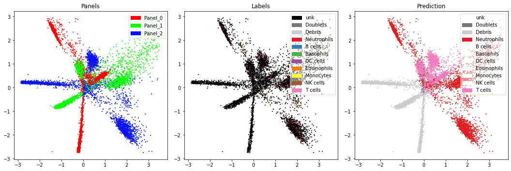
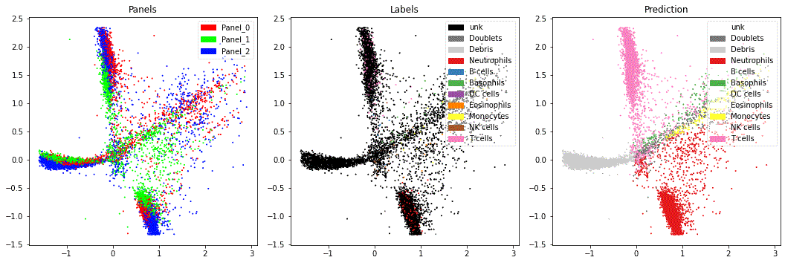
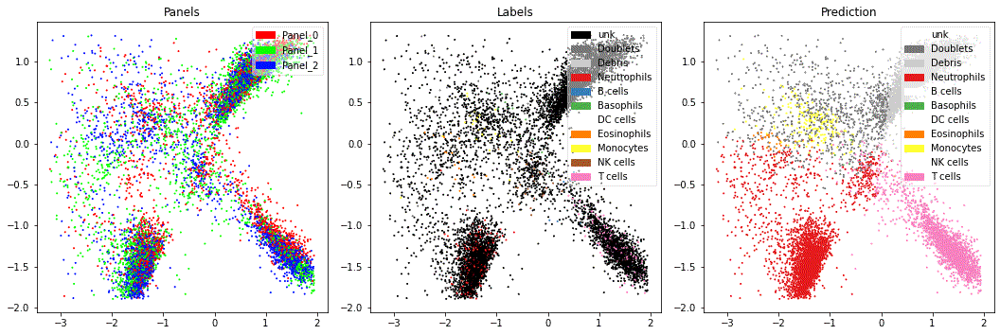
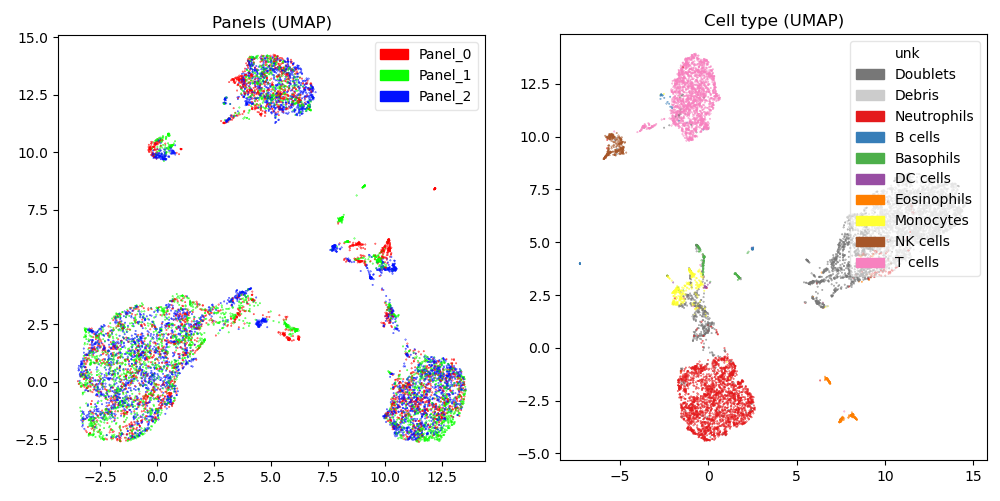
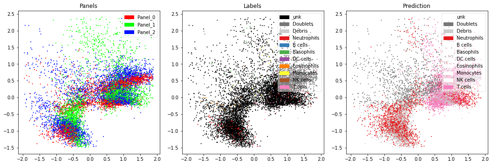
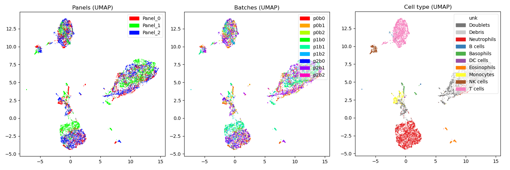

## Introduction

UVAE is a deep learning framework for training autoencoder-based latent variable models through simple description of objectives.

You can create models to automatically integrate disjoint data modalities, correct batch effects, perform regression, classification, and imputation over the joint latent space.

Currently column data is supported.

#### Dependencies

`tensorflow==2.10.1` 

Optional (Python):

`arm-mango` for hyper-parameter tuning,

`harmonypy` for LISI metric calculation,

`sklearn` (Gaussian Mixture) or `scanpy` (Leiden) for clustering,

`matplotlib umap-learn` for visualisation.


Optional (R):

`immunogenomics/lisi` for LISI metric calculation (if harmonypy is not used),

`cyCombine` for EMD/MAD metric calculation.

## Usage

As an example, let's import a toy dataset containing samples from a flow cytometry experiment. This sample was split into 3 separate panels (using different sets of markers). Each panel was further split into 3 batches. All splits were performed to result in random uneven class distribution across batches. Each batch had random offsets added to simulate batch effects. Finally, 90% of the ground truth labeling was hidden.
```python
from src.tools import *

# download sample data: https://zenodo.org/record/5748302/files/ToyData-3x3.pkl?download=1
toyDs = unpickle('ToyData-3x3.pkl')

X0, X1, X2 = toyDs['Xs'] # input values

chs0, chs1, chs2 = toyDs['enum']['markers'] # channel types (flow markers)

Y0, Y1, Y2 = toyDs['Ys']['label'] # cell-type labels

B0, B1, B2 = toyDs['Ys']['batch'] # batch assignment
```

    >>> X0.shape
    (27903, 19)
    >>> X1.shape
    (33176, 19)
    >>> X2.shape
    (38921, 19)
    
    >>> chs0
    ['FSC-A', 'FSC-H', 'FSC-W', 'SSC-A', 'SSC-H', 'SSC-W', 'CD56', 'HLA DR', 'CD11c', 'CD14', 'CD16', 'CD45', 'CD11b', 'CD3', 'CD62L', 'CD123', 'LD', 'CD10', 'CD24']
    >>> chs1
    ['FSC-A', 'FSC-H', 'FSC-W', 'SSC-A', 'SSC-H', 'SSC-W', 'CD56', 'HLA DR', 'CD11c', 'CD14', 'CD16', 'CD45', 'CD11b', 'CD3', 'CD62L', 'CD123', 'LD', 'CD1c', 'CD19']
    >>> chs2
    ['FSC-A', 'FSC-H', 'FSC-W', 'SSC-A', 'SSC-H', 'SSC-W', 'CD56', 'HLA DR', 'CD11c', 'CD14', 'CD16', 'CD45', 'CD11b', 'CD3', 'CD62L', 'CD10', 'CD24', 'CD1c', 'CD19']

    >>> np.column_stack(np.unique(Y0, return_counts=True))
    array([['B cells', '24'],
           ['Basophils', '59'],
           ['DC cells', '5'],
           ['Debris', '573'],
           ['Doublets', '231'],
           ['Eosinophils', '52'],
           ['Monocytes', '113'],
           ['NK cells', '98'],
           ['Neutrophils', '627'],
           ['T cells', '574'],
           ['unk', '25547']], dtype='<U21')

    >>> np.column_stack(np.unique(B0, return_counts=True))
    array([['p0b0', '9979'],
           ['p0b1', '8659'],
           ['p0b2', '9265']], dtype='<U21')

Notice that because some channels are different in each panel we can't simply concatenate the data and make a single embedding. To avoid losing unique information in each modality we will make independent latent embeddings and join them during training with soft loss constraints.

### Create semi-supervised models

To make an unsupervised embedding first create a UVAE object with a saving path, then add the input data, retaining a reference to each modality:

```python
from src.UVAE import *

uv = UVAE('toy.uv')

p0 = uv + Data(X0, channels=chs0, name='Panel 0')
p1 = uv + Data(X1, channels=chs1, name='Panel 1')
p2 = uv + Data(X2, channels=chs2, name='Panel 2')
```

The *p0 ... p2* objects are constraints referencing the added data. We will use them to add labelling and merging constraints on top.

By default, for each added *Data* modality, UVAE will create a variational autoencoder, which will be used to embed those data points for any further constraint. Default embedding is to **50** dimensions. See *UVAE_hyper.py* for other hyper-parameters.

Let's add a classifier which will extrapolate our partial labelling to the whole dataset. Our labels are stored in *Y0..2* corresponding to each *X0..2*, and *unk* is used to indicate a lack of annotation.

```python
ctype = uv + Classification(Y={p0: Y0, p1: Y1, p2: Y2}, nullLabel='unk', name='Cell type')
```

To be able to visualise the space during training let's add a consecutive autoencoder projecting the latent space from 50D to 2D:

```python
red2d = uv + Projection(masks=[p0, p1, p2], latent_dim=2, name='2D')
```

Training is performed by calling *train*. Model is saved automatically to the path specified during initialisation. Optionally, a callback function can be used to visualise the progress every epoch:

```python
from src.UVAE_diag import plotsCallback

uv.train(20, callback=plotsCallback)
```



Notice that the prediction is made for every cell, so no unknown samples remain in prediction. However, the result at the moment are 3 separate latent spaces. This is because no merging constraints were added.

### Merge latent embeddings

We can use the fact that our 3 modalities share a large number of markers. A *Subspace* constraint creates an additional autoencoder which uses the shared markers as input, and adds a pairwise merging loss between all included modalities and itself. This allows merging by using shared channels on a sample level, and by itself is not sensitive to class imbalance between modalities.

```python
sub = uv + Subspace(masks=[p0, p1, p2], name='Shared markers', pull=1)
```



This looks better, although closer inspection with UMAP shows that the modalities can still be separated:


There are two reasons for this: **1**: each modality contains unique information in its non-shared channels, and **2**: each panel contains own specific batch effects. See [*Normalisation*](#norm) for methods to address these problems.

*Maximum Mean Discrepancy* is another method of merging batches of samples which does not require shared channels. Instead, it assumes that the latent distribution between batches has matching density. UVAE implements MMD with multiscale RBF kernel from [trVAE](https://doi.org/10.1093/bioinformatics/btaa800). If MMD is defined between more than two sets of data, it is applied between two random sets in each training minibatch. Let's add MMD to merge the 3 panels:

```python
p_ids = {p0: np.repeat('0', len(p0.X)),
            p1: np.repeat('1', len(p1.X)),
            p2: np.repeat('2', len(p2.X))}

mmd = uv + MMD(Y=p_ids, name='MMD', pull=1)
```




The results are more aligned, and we can further increase overlap by increasing *pull*. However, remember that MMD forces latent densities to match. We know that our panels contain different proportions of cell-types, and therefore shouldn't match exactly. UVAE can address this problem by performing automatic control set balancing.

### <a name="norm"></a> Normalise and resample control sets

UVAE is designed to perform running normalisation of constraints based on dynamically sampled control sets. Typically, we want our controls to represent comparable samples of data from each batch or modality. For instance, we may want to normalise (move to a common mean) our batch data in latent space. However, because our batches contain imbalanced proportions of cell types, the mean statistic will not be directly comparable. We need to sample a similar control set from each batch before calculating the statistic.

The ground-truth batch assignment won't change throughout, so we can store it as *Labeling*. Unlike *Classification* this will not train a predictor, but simply return the ground truth labels when necessary:

```python
batch = uv + Labeling(Y={p0: B0, p1: B1, p2: B2}, name='Batch')
``` 

*Normalization* implements latent space arithmetics that mean-centers the embeddings of batches in the latent space, optionally to a specified target:

```python
ln = uv + Normalization(Y=batch.Y, name='Latent norm', target='p0b0')
```

We can use any *Classification* or *Labeling* to **resample** any other constraint. If the target of rebalancing is an *Autoencoder* or *Regression* (including their subclasses: *Classification*, *Projection*, *Subspace* etc.) it results in taking equal number of samples from each source class during training. If the target is a *Normalization* subclass (including *Standardization* or *MMD*), the resampling is performed **per batch**. For instance, specifying:

```python
ctype = uv['Cell type'] # our cell-type classifier added before
ctype.resample(ln)
```

will result in the cell-type classifier predicting the classes of all the samples affected by *Normalization* at the end of every epoch, and balancing them to have the same number of cells from each class in each batch.

```python
ln = uv + Normalization(Y=batch.Y, name='Latent norm', target='p0b0', balanceBatchAvg=True)
ctype.resample(ln)
```

The two lines above will, at the end of each epoch, predict the classes of the data (included in batch.Y), define a control set for each batch that includes the same proportion of classes across batches, calculate latent offsets for each batch to the center of *p0b0* (which is set as the normalisation target), and consequently subtract these offsets from all latent embeddings in a given batch. Specifying *target* is optional, if none is specified then batches are offset to a common center point. *balanceBatchAvg* makes resampling first determine the proportions of classes across all batches, then resample to a mean proportion. If *false*, each class is sampled equally (not preserving global proportions).

More than one resampling can be added to each target, in which case the underlying data will be divided into equal parts for each source. Additionally, the resampling and normalisation constraints can be *eased in*, so that classifiers have time to train. This is determined by *ease* parameter in UVAE_hyper.py.
### Conditional autoencoding

Let's create an autoencoder for a single modality, which consists of 3 batches. We want to apply MMD to merge the batches in the latent space and remove batch effects:

```python
uv = UVAE('mmd.uv')
p0 = uv + Data(X0, name='Panel')
mmd = uv + MMD(Y={p0: B0}, name='MMD_batch')
```

For training, UVAE will automatically add an autoencoder for the *Data* object and train to minimise a combination of reconstruction error and MMD. This however poses contradictory objectives: we want the latent distributions of batches to be indistinguishable, but at the same time we want the reconstruction of each batch to be faithful (and therefore contain batch-specific effects).

We can address this problem by conditioning the autoencoder to provide it with batch identifying information, so that it doesn't need to be redundantly captured in the latent space.

To add conditioning we need to manually instantiate the autoencoder and specify one or more conditions:

```python
uv = UVAE('mmd.uv')
p0 = uv + Data(X0, name='Panel')
batch = uv + Labeling(Y={p0: B0}, name='Batches')
ae0 = uv + Autoencoder(name=p0.name, masks=p0, conditions=[batch], condEncoder=True)
mmd = uv + MMD(Y={p0: B0}, name='MMD_batch')
```

Any autoencoder can be made conditional in this way. More than one conditioning can be specified simultaneously, each containing multiple classes. By default, both encoder and decoder are conditioned.

### Conditional generation

The **reconstruct()** function has two modes of operation. If no *channels* are specified, each sample from the requested map is generated from the corresponding autoencoder. If *channels* are specified, each sample is first encoded by its panel encoder, then generated from all the decoders which support requested channels, and averaged. This allows for cross-modal generation and imputation of missing markers.

E.g. to impute all available markers for all samples using all available panel decoders:

```python
# map covering all data
all_samples = uv.allDataMap()
# combined markers from all modalities
all_markers = np.unique(np.concatenate([d.channels for d in all_samples]))
# generate all markers for every sample by averaging decoders across modalities
rec_imputed = uv.reconstruct(all_samples, channels=all_markers)
```

A subset of panels which we want to use to decode can be explicitly specified:

```python
rec_imputed = uv.reconstruct(all_samples, channels=all_markers, decoderPanels=[p0, p1])
```

Specific target conditions can be used to generate data for each conditional autoencoder, or normalisation constraint:

```python
targets = {ln: 'p0b0', batch: 'p0b0'}
rec_imputed = uv.reconstruct(all_samples, channels=all_markers, targets=targets)
```

### Hyper-parameter tuning

Hyper-parameters such as model size, learning rates (separate for *unsupervised*, *supervised*, and *merge* losses), mutual frequency of training of each constraint, as well as *pull* strength can be automatically determined using *mango* Bayesian optimiser. The ranges and default values can be adjusted in *UVAE_hyper.py*. Each constraint has a *weight* parameter, which can be used to adjust its importance for model selection only. Optimisation is done by calling *optimize* on the instantiated UVAE object after adding all required data and constraints:

```python
uv.optimize(iterations=20, # training attempts
            maxEpochs=30, # max epochs during each training run
            earlyStopEpochs=0, # 0 if early stopping should not be used
            samplesPerEpoch=100000, # data samples per epoch
            valSamplesPerEpoch=100000, # validation samples per epoch
            sizeSeparately=True, # optimise width and depth of each constraint separately
            subset=['latent_dim', 'width', 'pull-MMD_batch'], # a subset of hyper-parameters to be optimised
            callback=None) # callback function called with the resulting model after each optimisation attempt
```

*Subset* is a list of hyper-parameter names. To include *pull* or *frequency* of individual constraints, use *pull-name* or *frequency-name* with the constraint name.

LISI metric can be included in the hyper-parameter optimisation loss. First, create an object storing information for LISI calculation:

```python
lisiSet = LisiValidationSet(dm=uv.allDataMap(), # data range to calculate LISI over
                            labelConstraint=ctype, # Labeling or Classification defining classes (which should remain separated)
                            batchConstraint=batch, # Labeling or Classification defining batches (which should be merged)
                            normClasses=True, # should equal number of class instances be sampled from each batch
                            labelRange=(1.0, 10.0), # expected range of score for class labeling (defaults to min:1.0, max:number of classes)
                            labelWeight=1.0, # label score contribution
                            batchRange=(1.0, 10.0), # expected range of score for batch labeling (defaults to min:1.0, max:number of batches)
                            batchWeight=1.0, # batch score contribution
                            perplexity=100) # LISI perplexity parameter
```

Any other metric can be added as a hyper-parameter optimisation loss by specifying a function which is called after each optimisation run. This function should accept the newly trained model as input, and return the loss contribution (lower is better):

```python
def customHyperoptLoss(model):
    score = ...
    return -score

uv.optimize(50, customLoss=customHyperoptLoss)
```

## Summary

To summarise, let's create a model which merges the panels using shared channels and MMD, while performing batch effect correction with conditional autoencoding and latent space normalisation. The classifier will be used to predict cell-types across the dataset and balance the sensitive merging and normalisation constraints:

```python
from src.UVAE import *

uv = UVAE('toy.uv')

p0 = uv + Data(X0, channels=chs0, name='Panel 0')
p1 = uv + Data(X1, channels=chs1, name='Panel 1')
p2 = uv + Data(X2, channels=chs2, name='Panel 2')

batch = uv + Labeling(Y={p0: B0, p1: B1, p2: B2}, name='Batch')

ae0 = uv + Autoencoder(name=p0.name, masks=p0, conditions=[batch])
ae1 = uv + Autoencoder(name=p1.name, masks=p1, conditions=[batch])
ae2 = uv + Autoencoder(name=p2.name, masks=p2, conditions=[batch])

ln = uv + Normalization(Y=batch.Y, name='Latent norm')

sub = uv + Subspace(masks=[p0, p1, p2], name='Shared markers', conditions=[batch], pull=1)
mmd = uv + MMD(Y=batch.Y, name='MMD', pull=1)

ctype = uv + Classification(Y={p0: Y0, p1: Y1, p2: Y2}, nullLabel='unk', name='Cell type')

ctype.resample(ln)
ctype.resample(mmd)

red2d = uv + Projection(latent_dim=2, name='2D')

uv.train(20)
```



